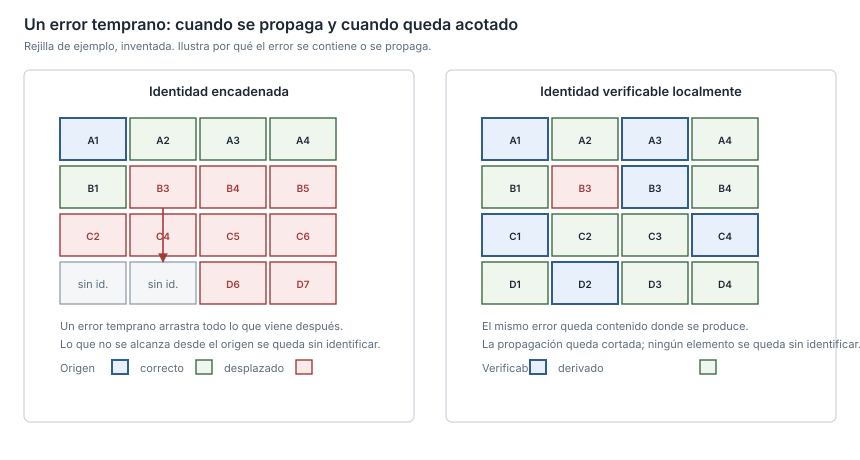

## What I can do

- Write the custom algorithm when the standard library does not reach: robust 2D
  geometry, structure detection in irregular shapes, propagation over
  neighbourhood graphs.
- **Voronoi diagrams over segments** with `scipy.spatial` and `shapely`, not
  just over points.
- Curvature detection with **Gaussian smoothing and prominence-based valleys**.
- Robust 2D boolean operations, spatial indexing, **PCA**, homographies and
  **B-spline / NURBS** curves for curved edges.

Before writing the algorithm I choose **the representation of the problem**,
which is usually half the solution. The other half is measuring.

## Good practices

- **Attack the representation, not the parameters.** When the result depends on
  sampling, the problem is almost never in the fine tuning: it is in how the
  problem was modelled.
- **Preserve the provenance** of each geometric primitive, so the result is
  unambiguous by construction instead of corrected afterwards.
- **Bounded errors rather than propagated ones**: each element derives its
  identity from verifiable local invariants, not from a dependency chain where
  one early failure drags everything with it.
- **Flag what is doubtful** instead of dropping it silently.
- **A cache keyed by input hash and schema version**, with its limit documented:
  it detects changes in the data, not in the code.

## When I use it

- When the result depends on a sampling parameter nobody can justify, the
  representation is the problem.
- **Voronoi over segments rather than points** when the input is contours:
  discretising into points introduces artefacts you then have to clean up.
- When comparing against a previous algorithm, **I first check whether the
  previous one is right**. If it is not, matching it is the wrong goal.

