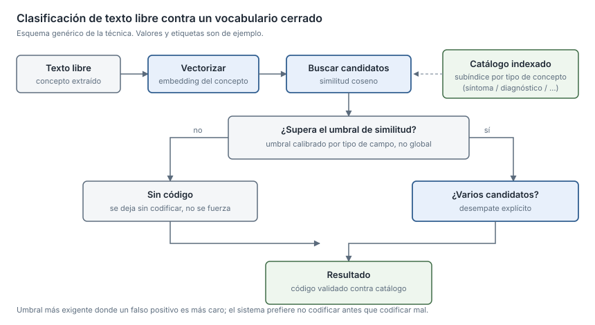

## Qué resuelve

Convierto texto escrito por personas en códigos de una taxonomía cerrada, de
forma automática y con control sobre los falsos positivos. He construido este
tipo de clasificador tres veces, con tres enfoques distintos, en dos productos
que están en producción.

Cuándo conviene un umbral de similitud sobre embeddings, cuándo basta una
búsqueda léxica bien puntuada y cuándo hay que combinar las dos es una decisión
que se toma midiendo. Pero la parte difícil no es elegir el modelo: es decidir
qué se codifica, con qué vocabulario, y qué hace el sistema cuando no está
seguro.

## Herramientas y técnicas

- Embeddings + similitud coseno con umbral, contra un catálogo indexado en base
  de datos.
- Umbrales **calibrados por tipo de campo**, no un umbral global.
- Desempate explícito entre candidatos admisibles.
- Búsqueda léxica puntuada sobre motor de indexación, con índices separados por
  idioma.
- Estrategia híbrida: recuperación por embeddings frente a recuperación por
  título.
- Política de codificación declarativa y validada.
- Python, PostgreSQL, Elasticsearch.

## Proyectos

### I+D de NLP biomédico · sector salud · 2023–2024

El pipeline de codificación completo, de principio a fin: mi aportación más
extensa en esta habilidad.

**Contexto** · Había que asignar códigos de varias taxonomías clínicas estándar a
los conceptos que aparecían en lenguaje natural en una conversación asistencial.

**Mi aportación** · **Diseñé e implementé el pipeline de codificación entero**,
de la extracción del concepto a la emisión del código.

**Cómo lo abordé** · Cada concepto extraído se resuelve contra un catálogo
indexado, con una **regla de desempate explícita** cuando varios candidatos son
admisibles, en lugar de quedarse con el primero. Los conceptos se enrutan a
subíndices según su naturaleza, decisión que tomé **tras medir** que el índice
único degradaba el acierto. Los umbrales son **distintos por tipo de campo** en
vez de globales: donde un falso positivo sale más caro, el umbral es más
exigente. La conexión al catálogo va separada de la de datos operativos, y el
proceso completo está paralelizado.

**Resultado** · El enfoque validado aquí pasó después al producto.

---

### Suite clínica modular · sector salud · 2025–2026

La política de codificación configurable: qué se codifica y con qué vocabulario,
sin tocar código.

**Contexto** · Varios módulos de producto necesitaban codificar contra distintos
sistemas terminológicos, y cada cliente quería codificar cosas distintas.

**Mi aportación** · La **política de codificación configurable** y el buscador
multiidioma.

**Cómo lo abordé** · En lugar de dejar la decisión de "qué se codifica con qué"
repartida por el código, la saqué a una **estructura declarativa multinivel** con
una función de validación que rechaza combinaciones imposibles y permite
sobrescritura parcial por despliegue. La configuración de entrada se valida de
forma estricta y con errores explicativos, con valores por defecto seguros,
sobrescritura parcial en vez de reemplazo total y copia defensiva para que nadie
mute la política global por accidente. Es de lo poco del conjunto que tiene un
test automatizado dedicado.

**Resultado** · Producto desplegado, con búsqueda multiidioma. Un cliente puede
cambiar la política sin tocar código. Las cifras concretas están sujetas a
confidencialidad.

---

### Producto asistencial en producción · sector salud · 2025–2026

La codificación como paso integrado dentro del flujo de extracción que corre en
cada consulta real.

**Contexto** · Aquí la codificación no es un sistema aparte, sino una pieza del
pipeline de LLM que cuento en
[Pipelines con LLM en producción](/myself/skills/pipelines-llm-produccion).

**Mi aportación** · La integración de la codificación dentro de los extractores
por campo, y el control de duplicados.

**Cómo lo abordé** · La codificación se aplica campo a campo, con verificación
contra catálogos maestros antes de dar por bueno un código —no se emite un
concepto que no exista— y deduplicación explícita.

**Resultado** · En producción con profesionales sanitarios. Medido con el banco
de evaluación que construí (ver
[Evaluación de sistemas de IA](/myself/skills/evaluacion-sistemas-ia)); las
cifras concretas no son publicables.
