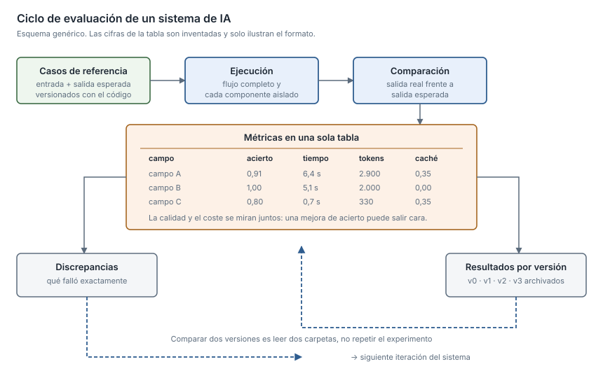

## What I can do

- Build a **versioned set of reference cases**, with expected output, so
  evaluation is reproducible.
- Score **per field**, not just globally: a high average hides the field that
  always fails, which is exactly the one to fix.
- Put **cost and latency in the same table as quality**, per phase and per field.
- Compare versions without repeating the experiment, by archiving results.
- Build the **dashboard** with no external dependencies.

It is the difference between using a model and **being able to answer for it**.
When someone asks "is this better than before?", I have something to answer with
rather than an impression.

## Good practices

- **The dataset versioned alongside the code**, so it does not depend on one
  machine.
- **Atomic mode**: each component measured in isolation, alongside the full
  flow, to locate where accuracy is lost.
- **Immutable results per version**: comparing two versions means reading two
  folders.
- **Discrepancy export** to CSV — the list of what failed, not just the number
  summarising it.
- **Cache usage measured, not assumed**: it is the cheapest lever on cost per
  call.
- **A log of the hypotheses that were ruled out**, so nobody retries them.
- A report with few numbers at the top for a quick look and the detail below for
  digging in.

## When I use it

- Before changing a prompt or moving to a new model version. Without a baseline,
  "it works better" is an opinion.
- When an accuracy gain **comes expensive**: seeing it before shipping, not in
  next month's invoice.
- When the reference system you compare against **is the one getting it wrong**,
  matching it stops being the goal. That is when I switch the metric to internal
  consistency and document why.

