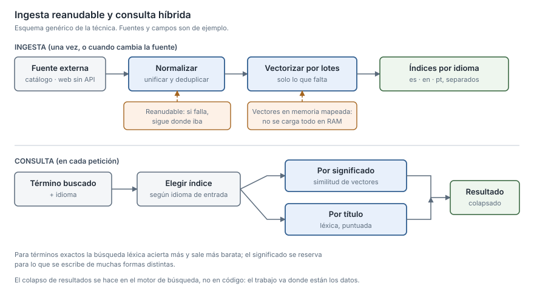

## What it solves

I bring data in from wherever it lives — an official catalogue, a database, a web
portal with no API — normalise it and leave it queryable, by text or by meaning.
Ingestion is built to be **resumable**: if it fails halfway it carries on from
where it was instead of starting over, and it does not recompute what it already
has.

Search by meaning does not always win. For exact terms, a well-scored lexical
search is more accurate and cheaper; deciding which one applies is part of the
job, and it gets decided by measuring.

## Tools and techniques

- Ingestion into an indexing engine with bulk loading and retries.
- Embeddings persisted in memory-mapped storage (`memmap`), without loading
  everything into RAM.
- Batch computation with resumption from what is already computed.
- Separate indices per language, selected at query time.
- Hybrid strategy: retrieval by meaning versus retrieval by title.
- Search engine scoring tuning.
- Index export and import between environments.
- Catalogue normalisation: unified nomenclature and deduplication.
- Browser automation for sources with no API.
- Python, pandas, numpy, Elasticsearch, PostgreSQL, Selenium.

## Projects

### Modular clinical suite · healthcare sector · 2025–2026

Several official catalogues, in different languages and formats, queryable from a
single point and with acceptable response times.

**Context** · The product needed to query official catalogues and vocabularies
from different sources, in different languages and in different formats, without
every query paying the price of that fragmentation.

**My contribution** · The **complete ingestion of those catalogues into the
indexing engine**, the multilingual search, the scoring tuning, and the index
export and import processes between environments. Also the download and
normalisation of an official regulated catalogue.

**How I approached it**

- **Embeddings persisted in index-addressable storage** rather than in memory:
  the full catalogue does not fit comfortably in RAM.
- **Resumption**: before computing, the process loads what has already been
  computed and only requests the missing terms, in batches. Recomputing an entire
  catalogue costs time and money; this avoids it.
- **One index per language**, selected at query time based on the input language,
  instead of a single mixed index.
- **Separating retrieval by meaning from retrieval by title**, because for exact
  terms lexical search was more accurate and cheaper.
- **Pushing the work down to the data engine** rather than resolving it in
  application code, moving it to where the data already was.
- **Index export and import**, to avoid repeating the full ingestion in every
  environment.
- Retries on external service calls, batch processing, idempotency — rerunning
  the ingestion neither duplicates nor recomputes — and text normalisation so
  spelling variants do not create separate entries.

**Outcome** · Deployed product, with multilingual search and configurable process
parameters. Volume and latency figures are covered by confidentiality.

---

### Extraction from a portal with no API · healthcare sector · 2023–2025

A third-party clinical system with no integration path of any kind, solved with
browser automation.

**Context** · Information had to be pulled out of a third-party clinical system
that offered no integration path whatsoever. The only way in was the web
interface.

**My contribution** · **Everything**: design and implementation of the complete
extractor.

**How I approached it** · Browser automation that walks the interface, navigates
the sections, extracts the information from the tables and dumps it into tabular
files; it also downloads the associated documents. It covers several functional
areas of the system.

**Outcome** · It was used to extract real data across several functional areas of
the system. Volume figures are covered by confidentiality.

---

### Biomedical NLP R&D · healthcare sector · 2023–2024

The data preparation and embedding loading that fed the coding pipeline.

**My contribution** · Data preparation and loading the catalogue embeddings into
the database, as a preliminary step of the coding pipeline I designed (detail in
[Classifying against controlled vocabularies](/myself/en/skills/clasificacion-vocabularios-controlados)).

**Outcome** · It left the catalogue queryable for the coding pipeline running on
top of it.
