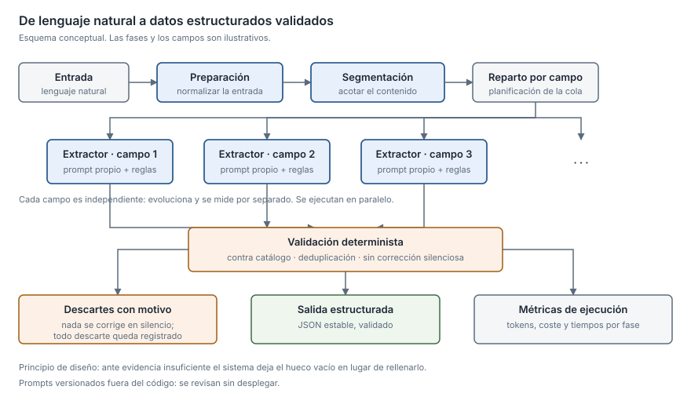

## What it solves

An LLM pipeline in production rarely fails because nobody knows how to call the
model. It fails when it invents, when it duplicates, and when nobody knows what
each run costs. I design flows that turn natural-language input into reliable
structured data, and keep them running in a domain where getting it wrong has
consequences.

The work is in breaking a large problem into independent phases and fields,
versioning the prompts outside the code, validating the output before treating it
as good, and controlling the spend per call. The hard part is not making the
model answer: it is making sure it **does not invent**, does not duplicate, and
says so when the evidence is not there instead of filling the gap.

## Tools and techniques

- Asynchronous orchestration of model calls (`asyncio`), parallelised per field.
- Prompts versioned in a data file, loaded by a dedicated module.
- Output forced to stable JSON, with schema validation.
- Deduplication and verification against master catalogues before emitting.
- Token and cost accounting per run.
- Authentication with a non-blocking token cache against a cloud provider.
- Streaming audio transcription with voice activity detection.
- Python, FastAPI.

## Projects

### Clinical product in production · healthcare sector · 2025–2026

My main contribution in this skill: the AI service that turns the recording of a
consultation into structured clinical information.

**Context** · The output goes field by field into the client's system and is read
by healthcare professionals, so an invented or duplicated value is not a cosmetic
defect: it is an error somebody has to catch by hand.

**My contribution** · **The AI service in Python**: the full flow of prompts and
model calls for the product's different clinical lines. The per-field extractors,
the prompt loader, the model client and the split of the code into phases are
mine.

**How I approached it**

- **Breaking the flow into explicit phases** and **one independent extractor per
  clinical field** instead of a single monolithic call. Each field has its own
  rules and can evolve without touching the others.
- **Prompts outside the code**, in a data file with its loader: they can be
  reviewed and versioned without deploying code.
- **Grouping requests per field** to cut the number of calls, and **planning the
  request queue** so the slowest task does not set the total time.
- **An authentication token cache** with early renewal, resolved outside the
  event loop so it never blocks it.
- Validation against master catalogues: a concept that does not exist is never
  emitted.
- Explicit duplicate control in the fields where repeating is a clinical error.
- Stable JSON output rather than free text parsed after the fact, and token and
  timing instrumentation switchable by environment variable.

**Outcome** · In production with healthcare professionals, with continuous
deployment and active work on new model versions. The pipeline is measured with
an evaluation bench I built, comparing versions over a reference case set;
the specific figures are covered by confidentiality.

---

### Biomedical NLP R&D · healthcare sector · 2023–2024

The earlier research where the approach that later reached the product was
tested.

**Context** · The point was to validate, on real clinical conversation, that a
transcription and extraction flow driven by a language model produced usable
results.

**My contribution** · **I designed and implemented the whole pipeline**:
transcription, structuring of the conversation with a language model, field
extraction and coding.

**How I approached it** · I restructured the project into modules by
responsibility and **parallelised the process**, which until then ran
sequentially. Thresholds became parameters instead of constants scattered through
the code.

**Outcome** · The approach validated here moved on to the product.

---

### Modular clinical suite · healthcare sector · 2025–2026

The same kind of clinical flow inside a multi-product platform with several
clinical modules.

**Context** · A clinical module that had grown mixing processes and shared
utilities, inside a platform holding several products.

**My contribution** · The **reorganisation of the clinical module**, separating
processes from shared utilities, cleaning up the code and applying good LLM and
prompt practice. I also documented the module's functions.

**How I approached it** · Separation between processes and shared utilities;
extraction of the decision policy into validated configuration; documentation of
the module's functions.

**Outcome** · Deployed product, in use.
