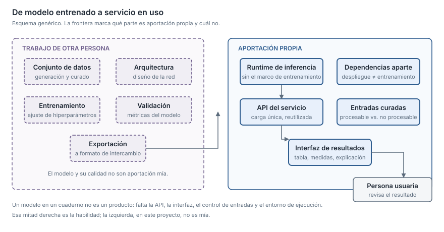

## What I can do

I take a model that already works in a notebook and turn it into something
somebody else can use: a service with its API, its interface, and a reasonable
response time. I can separate the training environment from the inference one,
serve the model in an interchange format instead of dragging the whole training
framework into production, and build the visualisation layer so the result is
interpretable by whoever will be looking at it.

**An important and deliberate caveat**: in the project where this skill applies
most clearly, **the model was trained by somebody else**. My work was putting it
into service. I say so up front because I would rather be clear from the start
than suggest otherwise.

## Tools and techniques

- Inference service with an HTTP API.
- Running models in an interchange format, with the training environment kept out
  of production.
- Separation between training and deployment dependencies.
- Frontend for visualising results.
- Curation of the input set: separating what is processable from what is not.
- Python, FastAPI, ONNX Runtime, JavaScript.

## Where I have done it

### Computer vision profile analysis · aerospace sector · 2026

**Context** · There was a trained vision model that identified the parts of
a structural section from its geometry, and a pipeline that reconstructed and
measured that section. Everything ran locally, executed by hand.

**What I did** · **Putting it into service.** Specifically:

- The **inference service** with an API, so an analysis could be requested rather
  than a script run.
- The **visualisation frontend**: input file upload, selection of the profile to
  analyse, section thumbnails, an explanation of the parameters and a results
  table.
- Fixing the **thickness calculation** and its presentation, including the detail
  of the variations.
- The **curation of the input set**, separating processable files from those that
  were not.

**What I did NOT do, and it is most of the project's value** · **I did not train
any model.** The vision models, the dataset generation and the export to the
interchange format are a colleague's work — they are the repository's main author
(18 of 22 commits against my 4). Nor did I write the geometric reconstruction pipeline.

**How I implemented it** · The service loads the model into an inference runtime
independent of the framework it was trained with, which avoids taking the
training environment into production. Deployment dependencies were declared
separately and in CPU versions, instead of reusing the GPU-accelerated training
ones.

**Good practices applied** · Separation between training and deployment
dependencies; loading the model once and reusing it across requests; an interface
that explains the parameters rather than showing bare numbers.

**What was missing** · The repository has no tests and no continuous integration,
and there is a divergent copy of the analysis code — two versions of the same
module to maintain in parallel. I did not introduce it, but
I did not resolve it either.

**Numbers** · 4 commits out of 22. No authorised service performance figures.

**In real use** · It was prepared for client review; specific change requests on
the sample were addressed.

---

### AI services in production · healthcare sector · 2025–2026

**Context** · The two clinical products where I work on the extraction pipeline
expose their AI functionality as deployed Python services.

**What I did** · The AI service of one of them is largely mine (detail in
[LLM pipelines in production](/myself/en/skills/pipelines-llm-produccion)). Here
what goes into production is not a model of my own, but a flow that consumes an
external provider's models, with its authentication, its credential cache, its
cost control and its instrumentation.

*Scope*: deployment, infrastructure and continuous integration are handled by
colleagues. My ground is the service, not the platform hosting it.

**In real use** · Yes, both in production.

## Where I fall short (and I say so)

**I have not trained deep learning models on a real project.** I can read what
the person who trained them did, integrate them and serve them, but architecture
design, training set preparation and hyperparameter tuning are not part of my
demonstrable experience. Nor have I set up deployment infrastructure or
continuous integration: I have worked inside platforms maintained by others.
